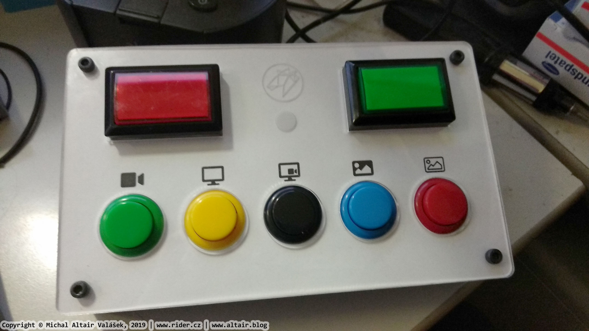
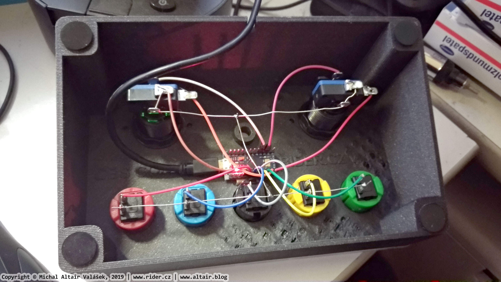

# OBS Control Rig MK1

This is the first version, which combines 3D printing, laser cutting and plotter cutting. The results are not as satisfactory as I hoped, printing such large object is slow and I was unable to print it flawlessly. I intend to make MK2, which will be completely laser cut.

* 3D printing
  * [`ObsControl.scad`](ObsControl.scad) - parametric OpenSCAD model
  * [`ObsControl_1.5.stl`](ObsControl_1.5.stl) - resulting STL model
* Cutting
  * [`ObsControl.ai`](ObsControl.ai) - vector file containing layers for printing, paper cutting and laser cutting & engraving.
  * [`ObsControl_laser.ai`](ObsControl_laser.ai) - vector file for laser cutting and engraving. The circle under logo is diffusor for status LED, which is not used at the time being.
  * [`ObsControl_plotter.studio3`](ObsControl_plotter.studio3) - Silhouette Studio file for paper printing and cutting.

## Front View

## Back View

