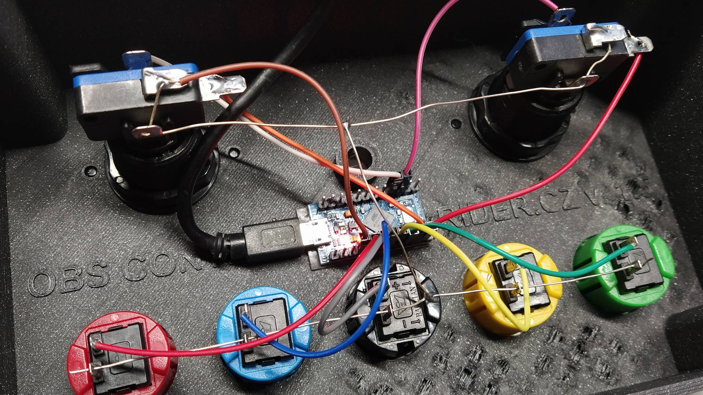

# OBS Control Firmware

This is sketch for Arduino Pro Micro or other ATmega32u4-based Arduino board. It handles button presses and emulates USB keyboard.

It recognizes two types of buttons:

1. _Standard buttons_, which simply send the keystroke to computer. I use them for switching scenes 1-5. Their state can be indicated with optional RGB LED (I use APA106, but any neopixel-style LED can be used).
2. _Status buttons_, which toggle states and can turn on/off LEDs. I use the backlighted buttons for stream and record control. Again they send keystrokes to computer. The status management is done only in controller, no backwards communication occurs.

As a keystroke I use _Ctrl+Alt+Shift+F1_ for first standard button, _Ctrl+Alt+Shift+F2_ for second etc. The status button follows.

So, with this firmware I use the following mapping:

Command                           | Keystroke
----------------------------------|------------------
Switch to scene "Camera only"     | Ctrl+Alt+Shift+F1
Switch to scene "Screen only"     | Ctrl+Alt+Shift+F2
Switch to scene "Screen + camera" | Ctrl+Alt+Shift+F3
Switch to scene "Brand loop 1"    | Ctrl+Alt+Shift+F4
Switch to scene "Brand loop 2"    | Ctrl+Alt+Shift+F5
Start/stop recording              | Ctrl+Alt+Shift+F6
Start/stop streaming              | Ctrl+Alt+Shift+F7

## Hardware connection

For _Pro Micro_ board I recommend to solder pins upside down (so they stick out of component side) so the flat board side can be hotglued to the box.

PIN | Connect
--- | -------
D2  | Red button
D3  | Blue button
D4  | Black  button
D5  | Yellow button
D6  | Green  button
D7  | Square green button (stream)
D8  | Square red button (record)
D14 | Square red LED (record)
D15 | Square green LED (stream)
D16 | RGB LED Data in
VCC | RGB LED power
GND | Common ground (buttons & LEDs)

## Example wiring

MK1 from bottom side. Does not include the RGB LED.